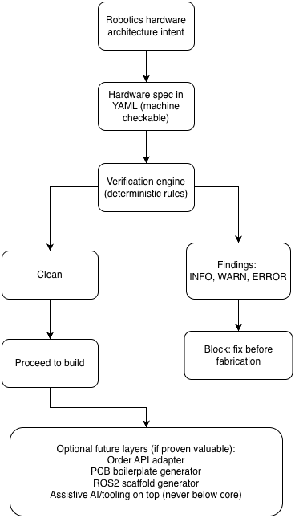
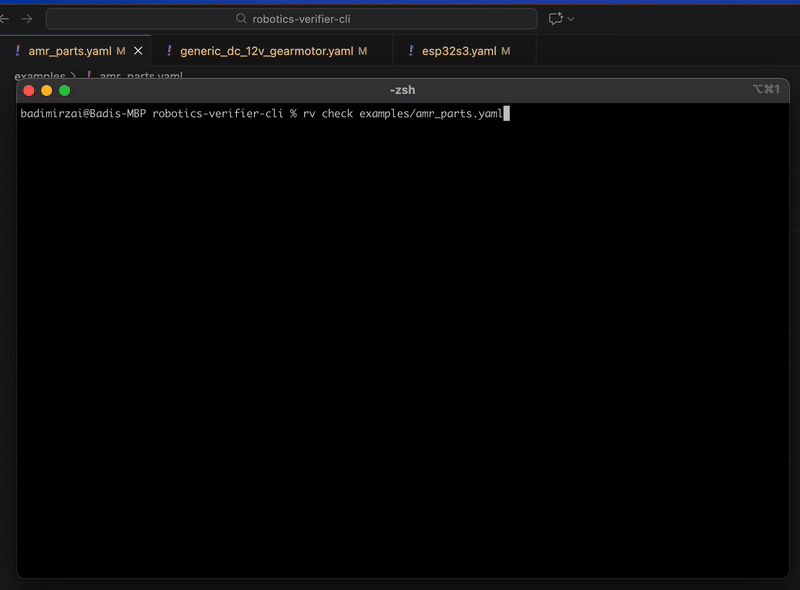

# Robotics Verifier (rv-cli) [](https://github.com/badimirzai/robotics-verifier-cli/actions/workflows/ci.yaml) [](https://github.com/badimirzai/robotics-verifier-cli/releases)

A command line tool for verifying robotics hardware specifications **before** you build.
It flags electrical integration failures early, so they never reach fabrication or firmware.

Robot integration hides failure points: voltage mismatches, torque shortfalls, driver limits, current spikes, logic-rail traps.

This tool checks your configuration and surfaces those mistakes immediately, with deterministic rules and explainable output.

No hidden network calls. No guessing. No AI hallucinations.
It only checks what you tell it to check - nothing more, nothing less.

---

## Why

Most robotics problems start before code runs. Incorrect voltage ranges. Drivers that cannot supply required current. Logic level mismatches. These issues waste time, damage parts, and block progress.

This tool enforces a hardware contract so preventable failures surface immediately. Local and in CI.

---

## How it works (at a glance)



---

## Quick start (90 seconds)

### Install

Requires Go **1.25.5** or newer (https://go.dev/dl/).

```bash
go install github.com/badimirzai/robotics-verifier-cli/cmd/rv@latest
rv --help
```

### Minimal example

Create a file named `spec.yaml`:

```yaml
name: "minimal-voltage-mismatch"

power:
  battery:
    voltage_v: 12
    max_current_a: 10
  logic_rail:
    voltage_v: 3.3
    max_current_a: 1

mcu:
  name: "Generic MCU"
  logic_voltage_v: 3.3
  max_gpio_current_ma: 12

motor_driver:
  name: "TB6612FNG-like"
  motor_supply_min_v: 18
  motor_supply_max_v: 24
  continuous_per_channel_a: 0.6
  peak_per_channel_a: 6
  channels: 1
  logic_voltage_min_v: 3.0
  logic_voltage_max_v: 5.5

motors:
  - name: "DC motor"
    count: 1
    voltage_min_v: 6
    voltage_max_v: 12
    stall_current_a: 5
    nominal_current_a: 1
```

Run:

```bash
rv check spec.yaml
```

Example output:

```text
rv check
--------------
INFO DRV_CHANNELS_OK: channels OK: 1 motors <= 1 motor_driver.channels
ERROR DRV_SUPPLY_RANGE: battery 12.00V outside motor_driver motor supply range [18.00, 24.00]V
WARN DRV_CONT_LOW_MARGIN: motor_driver.continuous_per_channel_a 0.60A may be low for motor DC motor nominal 1.00A (want >= 1.25A)
INFO RAIL_BUDGET_NOTE: logic rail budget set to 1.00A (v1 does not estimate MCU+driver logic draw yet)
exit code: 2
```

Interpretation:
- The supply voltage cannot power the driver. This is a hard stop.
- The driver continuous current is lower than motor nominal current margin. Proceeding is risky.

---

## Demo



[▶️ Watch full quality demo (MP4)](./assets/demo.mp4)

### Core commands

```text
rv check <file.yaml>       Run analysis
rv version                 Show installed version
rv check --output json     Emit JSON findings
rv --help                  Show all commands and flags
rv check --help            Show check command options
```

## What it checks today

- Voltage compatibility between supply and drivers
- Current sufficiency for stall and nominal loads
- Driver to motor channel allocation
- Basic logic level consistency
- Logic rail compatibility between MCU and motor driver
- Battery C rate vs total peak stall current (motors)
- Total motor stall current vs driver peak current across all channels

**Note**: Checks are skipped when required inputs are missing (zero). This keeps partial specs usable.

Findings:
- INFO for context
- WARN for risk
- ERROR for violations (non zero exit code)

CI example:

```yaml
steps:
  - name: Verify hardware spec
    run: rv check specs/robot.yaml
```

JSON example:

```bash
rv check specs/robot.yaml --output json
```

JSON file output example:

```bash
rv check specs/robot.yaml --output json --out-file report.json
```

JSON pretty output example:

```bash
rv check specs/robot.yaml --output json --pretty
```

JSON pretty + file output example:

```bash
rv check specs/robot.yaml --output json --pretty --out-file report.json
```

---

## Supported configurations (v0.1)

Focused on early stage mobile robots.

Supported:
- DC motors (one motor per driver channel)
- TB6612FNG and L298 class H bridge drivers
- Single logic rail
- Basic YAML part inheritance

Not supported yet:
- Stepper, BLDC, ESC
- Multi rail power trees
- Thermal derating
- Serial or IO protocol arbitration

This is a linter. Not a simulator or optimizer.

---

## YAML specification

The core fields used in validation are:

- power.battery.voltage_v
- power.battery.capacity_ah
- power.battery.c_rating
- power.battery.max_discharge_a
- power.battery.max_current_a
- motor_driver.motor_supply_min_v
- motor_driver.motor_supply_max_v
- motors[].stall_current_a
- motor_driver.peak_per_channel_a

Battery max discharge uses the following precedence:
1) power.battery.max_discharge_a
2) power.battery.capacity_ah * power.battery.c_rating
3) power.battery.max_current_a

Unset or missing fields are treated as unknown. Some required values will surface as errors during resolution.

More examples are available in the `examples/` directory.

---

## Versioning and stability

The interface is still evolving. Breaking changes may happen before 1.0.

Exit codes and rule identifiers are stable within a minor version:
- 0 clean
- 2 rule violations
- 3+ parser or internal errors

---

## CLI output options

Output control flags (check command):
- --output json: machine readable JSON to stdout
- --pretty: pretty print JSON to stdout (requires --output json)
- --out-file <path>: write compact JSON to file (requires --output json)
- --debug: enable debug mode (or use RV_DEBUG=1)

Output behavior matrix:
- rv check spec.yaml: human-readable output
- rv check spec.yaml --output json: compact JSON to stdout
- rv check spec.yaml --output json --pretty: pretty JSON to stdout
- rv check spec.yaml --output json --out-file result.json: writes compact JSON and prints "Written to result.json"
- rv check spec.yaml --output json --pretty --out-file result.json: pretty JSON to stdout and compact JSON to file

See `CHEATSHEET.md` for a quick command reference.

---

## Determinism first

Trust is the primary feature.

This tool does not guess, fetch, or infer part data. It validates what you specify. Assistive or automated layers may come later, but only on top of a proven deterministic core.

---

## Contributing

Open an issue before starting work so scope can be aligned.

By contributing you agree to the CLA in `CLA.md`.

---

## License

Apache 2.0. See `LICENSE`.

---

## Disclaimer

This tool does not replace datasheets or engineering judgement.
Not suitable for safety critical systems.
Use at your own risk. Early alpha.
